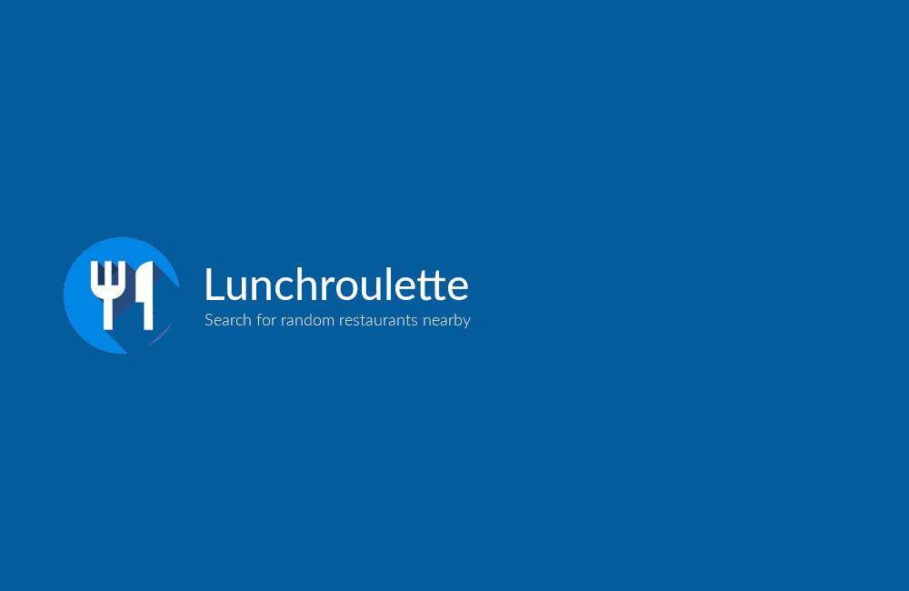

# Lunchroulette

Lunchroulette helps you decide where to have lunch by randomly picking a restaurant in your area. Open [the website](https://soyguijarro.github.io/lunchroulette) and tap the _I'm feeling lucky_ button to get a random restaurant nearby. Press on the walking distance information at the bottom to open the location in Google Maps, or tap the refresh button at the top right to get another suggestion.

## Technology

The web app is build with [React](https://facebook.github.io/react/). Styles are written in plain CSS and automatically prefixed with [Autoprefixer](https://github.com/postcss/autoprefixer). [Babel](http://babeljs.io/) is used for transpiling and [Webpack](https://webpack.github.io/) for module bundling. [Create React App](https://github.com/facebookincubator/create-react-app) was used to take care of all this tooling. The site is hosted in [GitHub Pages](https://pages.github.com/) and deployed with [gh-pages](https://github.com/tschaub/gh-pages)'s command line utility through a simple npm script.

In order to get restaurant details and distance information, [Google Places](https://developers.google.com/places/javascript/) and [Google Maps Distance Matrix](https://developers.google.com/maps/documentation/javascript/distancematrix) APIs are used, as well as the [web geolocation API](https://developer.mozilla.org/en-US/docs/Web/API/Geolocation/Using_geolocation). A [web app manifest](https://developers.google.com/web/fundamentals/engage-and-retain/web-app-manifest/) is included so that the site behaves more like a native app when added to the home screen in supported mobile browsers (namely, Chrome for Android).

## Motivation

The project started pretty much as a joke at the office. We were always arguing about where to go for lunch, so at some point I made a very simple website that picked a random name from a harcoded list of restaurants that we knew in the area. That solved our little problem, but then my coworkers jokingly complained that no information about the suggested restaurant was shown, like a photo, how far it was and so on. I ended up taking a look at the [Google Maps JavaScript API](https://developers.google.com/maps/documentation/javascript/) and realized that it was not that difficult to do, so I went ahead and built this web app as an opportunity to play around with the API.

## Acknowledgments

The design of the web app is heavily inspired by the [Material design](https://material.google.com/) guidelines in general and the [Google Maps](http://maps.google.com) interface in particular. The app icon was generated with help of [Android Material Icon Generator](https://android-material-icon-generator.bitdroid.de/).

## Issues and suggestions

If you find any errors or have suggestions for this project, please [open an issue](https://github.com/soyguijarro/lunchroulette/issues) and I'll do my best to help.
